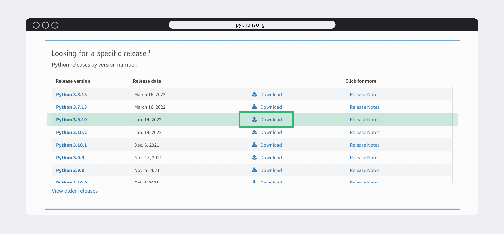
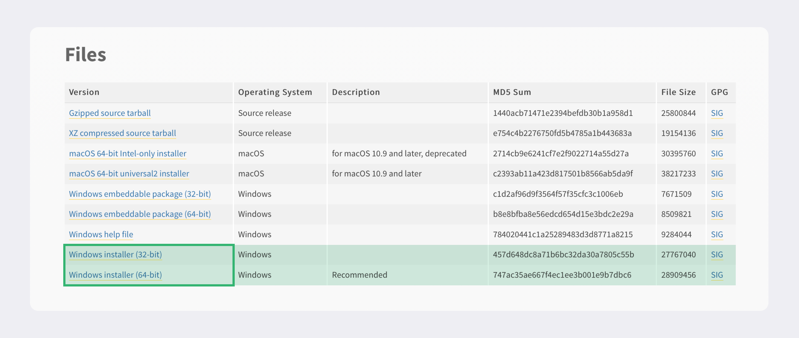
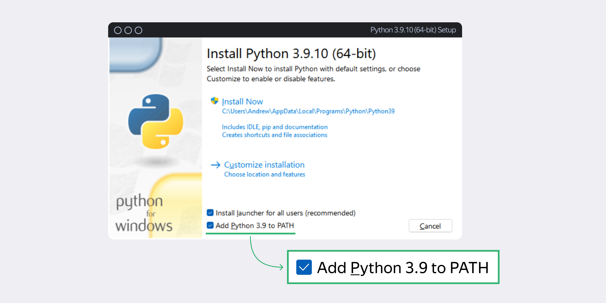

# Инструкция по установке Python на Windows 10 и выше

Это руководство дает пошаговое описание установки интерпретатора Python. После завершения установки вы сможете запускать приложение для анализа феномена Translationese на своем компьютере.

## Шаг 1: Скачивание Python

1. Откройте браузер и перейдите на официальный сайт Python: [https://www.python.org](https://www.python.org).


2. Перейдите в раздел Downloads. Вы попадёте на страницу загрузки интерпретатора.  Выберите версию 3.9.10. и нажмите Download.



3. Вы окажетесь на странице с информацией о нужной вам версии интерпретатора Python. Проскролльте её вниз — до таблички с файлами на скачивание. Выберите файл, подходящий для разрядности вашей операционной системы, и скачайте его:

Чтобы узнать разрядность вашей операционной системы, выполните следующие шаги:
   - откройте меню «Пуск»,
   - выберите «Все приложения»,
   - перейдите в «Служебные»,
   - выберите «Windows», 
   - «Командная строка». 
   - В командной строке введите команду `systeminfo`. Она отобразит информацию о конфигурации компьютера и версии операционной системы. Разрядность ОС будет указана в строке «Тип системы».

## Шаг 2: Установка Python

1. Запустите скачанный `.exe` файл: кликните по нему правой кнопкой мыши и выберите пункт **«Запустить от имени администратора»**. 


2. Когда откроется окно установки, **обязательно поставьте галочку (!)** возле пункта Add Python 3.9 to PATH и нажмите Install now:



3. Нажмите на **Install Now** для начала установки. 


4. Когда установка завершится, нажмите  **Close**.

## Шаг 3: Проверка установки Python

1. Для проверки, что интерпретатор Python установлен и готов к работе, откройте приложение «Командная строка»: 
«Пуск» → «Все приложения» → «Служебные» — Windows → «Командная строка».


2. Введите в командной строке:

   ```bash
   python --version
   ```

   Если установка прошла успешно, вы увидите версию Python, например, `Python 3.9.10`.

## Шаг 4: Установка среды разработки (IDE)

Среда разработки позволит запустить приложение для анализа феномена Translationese. Мы рекомендуем установить одну из следующих IDE:

- **PyCharm Community Edition**: [https://www.jetbrains.com/pycharm/](https://www.jetbrains.com/pycharm/download/) - Версия Community Edition является бесплатной и подходит под наши задачи больше всего.
- **VS Code**: [https://code.visualstudio.com](https://code.visualstudio.com)
